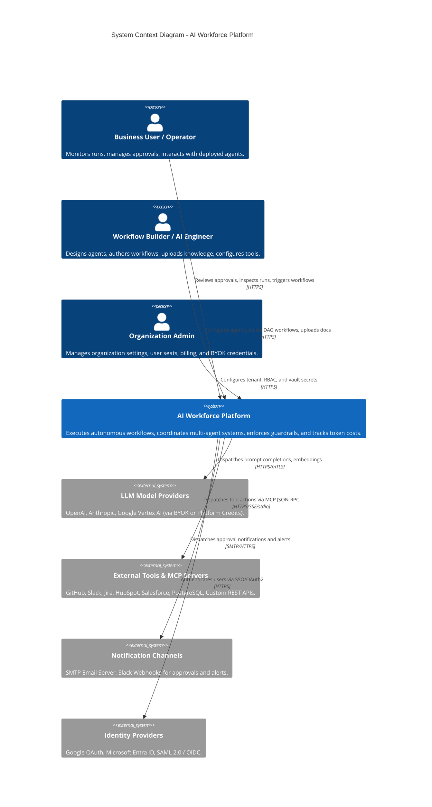
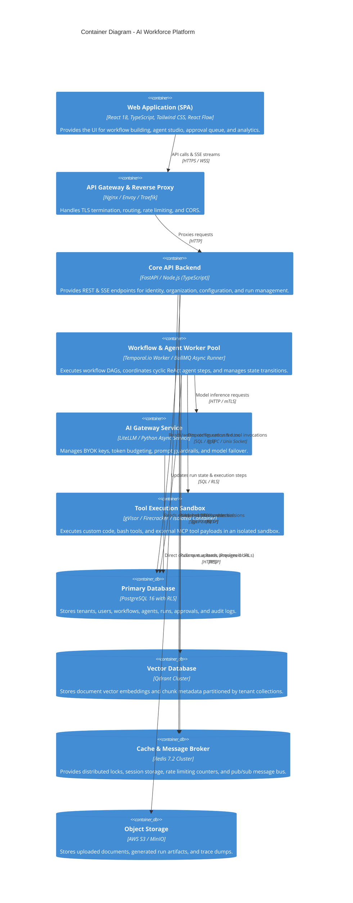
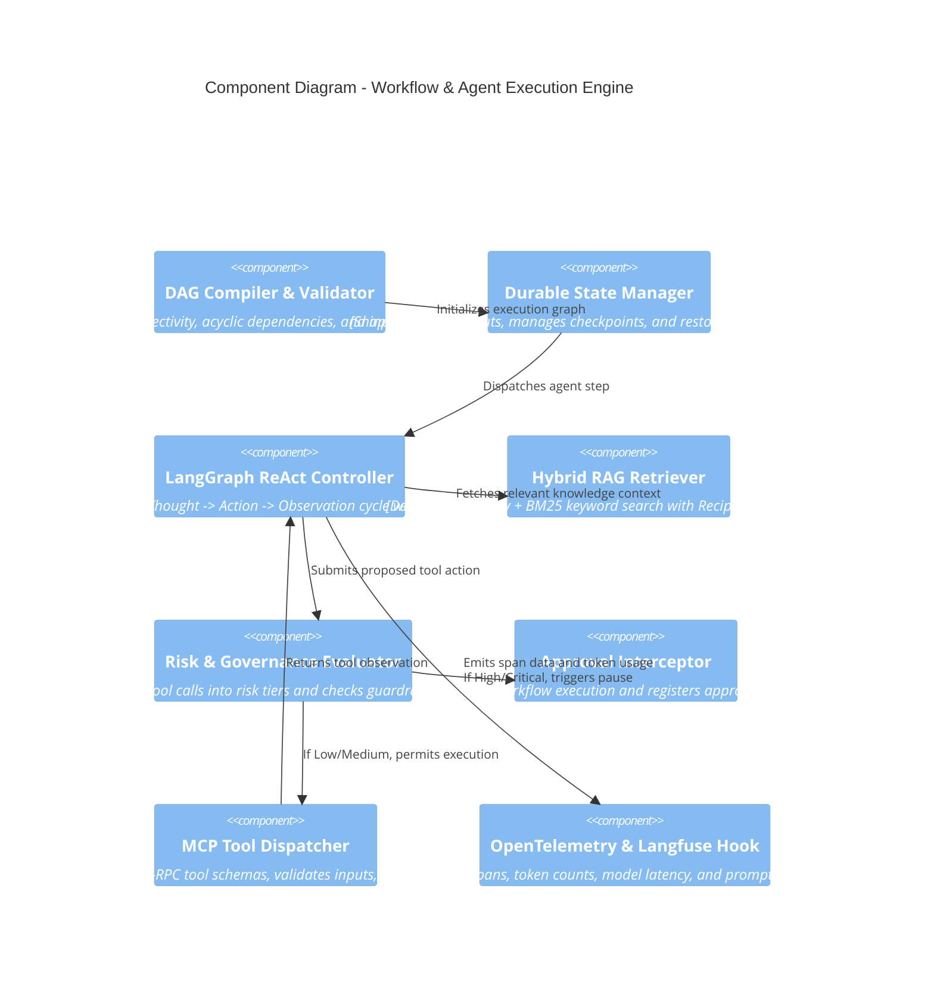
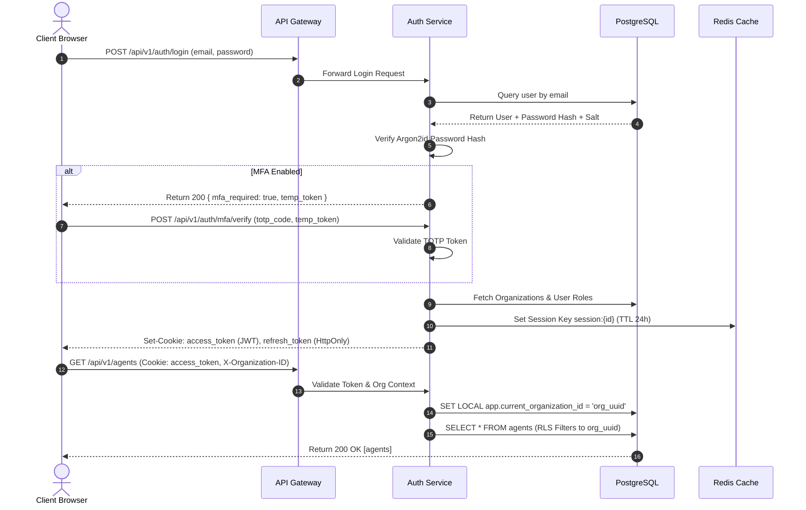
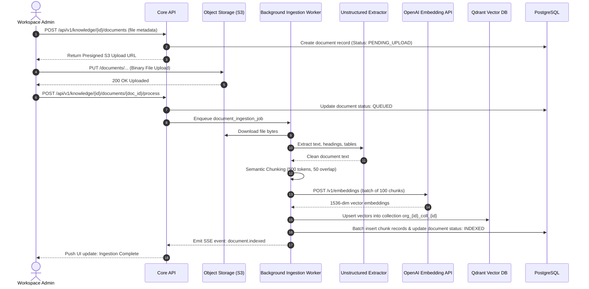
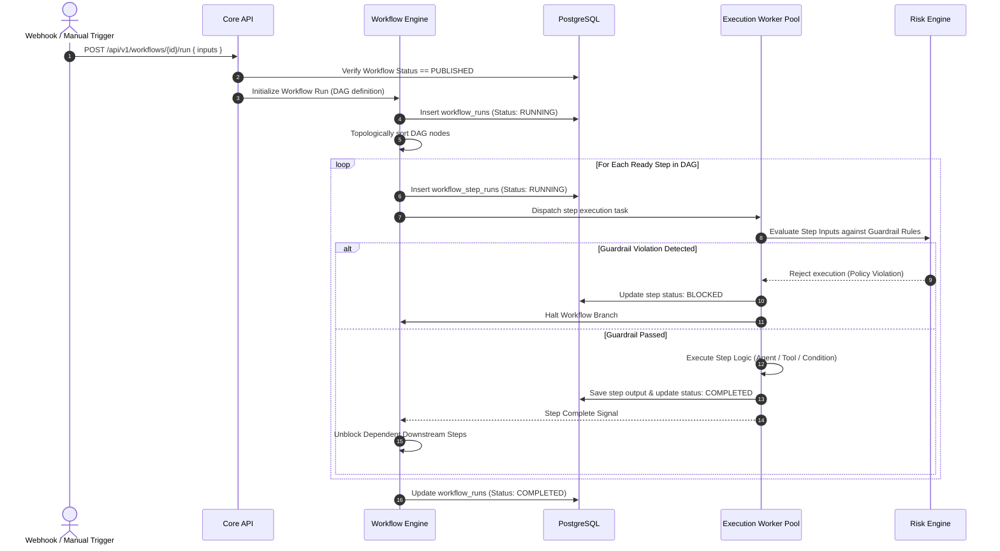
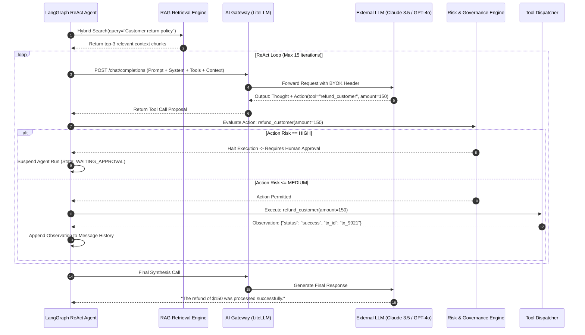
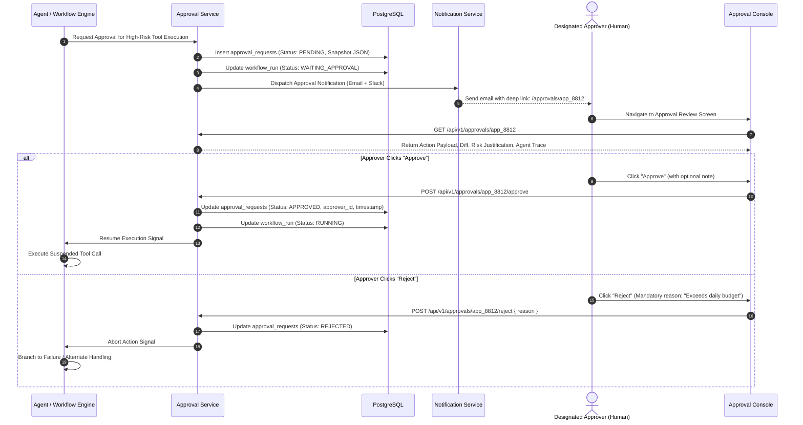
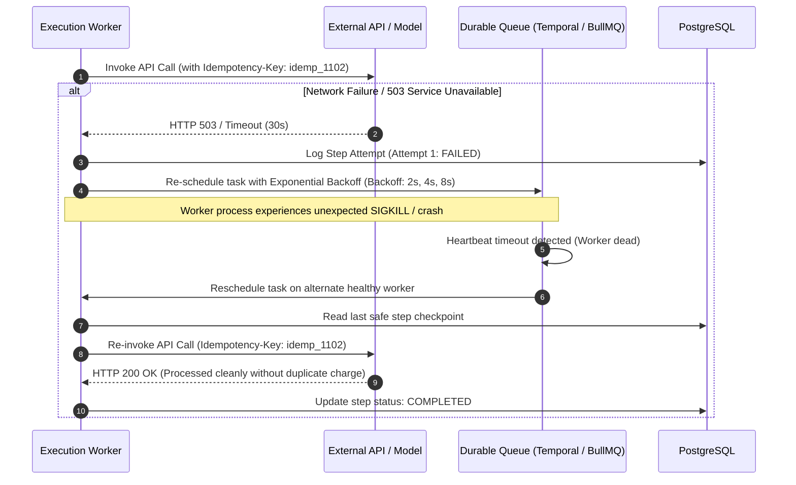

# SYSTEM ARCHITECTURE SPECIFICATION
## AI Workforce — Autonomous Business Workflow Automation Platform
**Document Identifier:** SAS-AIWF-2026-001  
**Version:** 1.0.0 | **Status:** FINAL & APPROVED  
**Classification:** Confidential — Engineering & Architecture  
**Target Audience:** Principal Engineers, Architects, DevSecOps, Platform Engineering  

---

## TABLE OF CONTENTS
1. [Executive Architectural Summary](#1-executive-architectural-summary)
2. [Architectural Principles & Non-Negotiable Constraints](#2-architectural-principles--non-negotiable-constraints)
3. [C4 Architecture Models](#3-c4-architecture-models)
   - 3.1 [C4 Level 1: System Context Diagram](#31-c4-level-1-system-context-diagram)
   - 3.2 [C4 Level 2: Container Diagram](#32-c4-level-2-container-diagram)
   - 3.3 [C4 Level 3: Component Diagram (Core Engine)](#33-c4-level-3-component-diagram-core-engine)
4. [Subsystem & Service Boundary Specifications](#4-subsystem--service-boundary-specifications)
   - 4.1 [Edge & Ingress Gateway](#41-edge--ingress-gateway)
   - 4.2 [API Service & IAM Layer](#42-api-service--iam-layer)
   - 4.3 [Workflow Engine (DAG & Execution Orchestrator)](#43-workflow-engine-dag--execution-orchestrator)
   - 4.4 [Agent Execution Engine (LangGraph ReAct Loop)](#44-agent-execution-engine-langgraph-react-loop)
   - 4.5 [AI Gateway & Model Router](#45-ai-gateway--model-router)
   - 4.6 [Knowledge Ingestion & Hybrid RAG Pipeline](#46-knowledge-ingestion--hybrid-rag-pipeline)
   - 4.7 [Model Context Protocol (MCP) & Tool Dispatcher](#47-model-context-protocol-mcp--tool-dispatcher)
   - 4.8 [Human-in-the-Loop (HITL) & Approval Engine](#48-human-in-the-loop-hitl--approval-engine)
   - 4.9 [Guardrails & Risk Evaluation Engine](#49-guardrails--risk-evaluation-engine)
   - 4.10 [Observability, Tracing & Token Metering](#410-observability-tracing--token-metering)
   - 4.11 [AI Evaluation Engine](#411-ai-evaluation-engine)
   - 4.12 [Notification & Event Dispatcher](#412-notification--event-dispatcher)
5. [Data Tier & Storage Architecture](#5-data-tier--storage-architecture)
   - 5.1 [Relational Persistence (PostgreSQL with RLS)](#51-relational-persistence-postgresql-with-rls)
   - 5.2 [Vector Persistence (Qdrant Namespace Isolation)](#52-vector-persistence-qdrant-namespace-isolation)
   - 5.3 [Cache & Distributed State (Redis Cluster)](#53-cache--distributed-state-redis-cluster)
   - 5.4 [Blob & Object Storage (S3 / MinIO)](#54-blob--object-storage-s3--minio)
6. [End-to-End System Flows](#6-end-to-end-system-flows)
   - 6.1 [Authentication & Tenant Context Flow](#61-authentication--tenant-context-flow)
   - 6.2 [Knowledge Ingestion & Vector Indexing Flow](#62-knowledge-ingestion--vector-indexing-flow)
   - 6.3 [Workflow DAG Compilation & Step Execution Flow](#63-workflow-dag-compilation--step-execution-flow)
   - 6.4 [Cyclic Agent Reasoning & Tool Invocation Flow](#64-cyclic-agent-reasoning--tool-invocation-flow)
   - 6.5 [HITL Interruption, Approval & Resumption Flow](#65-hitl-interruption-approval--resumption-flow)
   - 6.6 [Failure Recovery, Backoff & Idempotent Resumption](#66-failure-recovery-backoff--idempotent-resumption)
7. [Component Attribute Matrix](#7-component-attribute-matrix)
8. [High-Availability, Scalability & Disaster Recovery](#8-high-availability-scalability--disaster-recovery)

---

## 1. EXECUTIVE ARCHITECTURAL SUMMARY

The **AI Workforce** platform is an autonomous business workflow automation platform engineered for enterprise multi-tenancy. It bridges high-level business goals with deterministic software execution by treating AI agents as autonomous digital workers operating inside governed, observable, and human-in-the-loop (HITL) workflows.

The system is architected as an **Event-Driven Modular Monolith transitioning to Microservices**, utilizing asynchronous queues, durable workflow state machines, and a sandboxed AI Gateway. It guarantees absolute tenant isolation, verifiable audit trails, and strict human oversight for sensitive operations.

```
┌────────────────────────────────────────────────────────────────────────────────────────┐
│                                 AI WORKFORCE PLATFORM                                  │
│                                                                                        │
│   Web Console (React 18 + TS)         REST / SSE API Gateway (FastAPI / Fastify)       │
│                 │                                          │                           │
│                 ▼                                          ▼                           │
│   ┌───────────────────────────┐              ┌───────────────────────────┐             │
│   │   Workflow Orchestrator   │◄────────────►│   Agent Execution Engine  │             │
│   │   (Durable State Machine) │              │   (LangGraph ReAct Loop)  │             │
│   └─────────────┬─────────────┘              └─────────────┬─────────────┘             │
│                 │                                          │                           │
│                 ├────────────────────┬─────────────────────┤                           │
│                 ▼                    ▼                     ▼                           │
│   ┌───────────────────────────┐┌───────────┐ ┌───────────────────────────┐             │
│   │     Hybrid RAG Engine     ││HITL Engine│ │     Tool & MCP Router     │             │
│   │    (Qdrant + BM25 RRF)    ││ (Approval)│ │    (Sandboxed Workers)    │             │
│   └───────────────────────────┘└───────────┘ └───────────────────────────┘             │
│                 │                    │                     │                           │
│                 └────────────────────┼─────────────────────┘                           │
│                                      ▼                                                 │
│                        ┌───────────────────────────┐                                   │
│                        │    AI Gateway & Router    │                                   │
│                        │ (LiteLLM + BYOK Vault)    │                                   │
│                        └─────────────┬─────────────┘                                   │
│                                      ▼                                                 │
│                   External LLM Providers (OpenAI, Anthropic)                           │
└────────────────────────────────────────────────────────────────────────────────────────┘
```

---

## 2. ARCHITECTURAL PRINCIPLES & NON-NEGOTIABLE CONSTRAINTS

1. **Mandatory Tenant Scoping (`organization_id`)**: Every database table, API request, cache key, vector collection, and background job must explicitly bind to an `organization_id`. Database-level Row-Level Security (RLS) is enabled across all relational tables.
2. **Durable State Machine**: Workflow executions and agent runs are persisted prior to step dispatch. Any unexpected node crash allows the runner to resume from the last known safe state without re-executing completed side-effects.
3. **Zero Direct LLM Access**: Services do not make raw HTTP calls to OpenAI, Anthropic, or external model providers. All model invocations must pass through the **AI Gateway**, which enforces token budgets, rate limits, PII redaction, and audit logging.
4. **Governed Tool Execution**: External side-effects are categorized into risk tiers (`Low`, `Medium`, `High`, `Critical`). High and Critical actions halt execution and invoke the **HITL Engine**, awaiting signed human approval.
5. **Zero Mock/Test Data in Production**: Production infrastructure (`aiwf_prod`) never hosts test fixtures, demo organizations, or simulated runs. Ephemeral test containers are used during CI/CD.

---

## 3. C4 ARCHITECTURE MODELS

### 3.1 C4 Level 1: System Context Diagram



### 3.2 C4 Level 2: Container Diagram



### 3.3 C4 Level 3: Component Diagram (Core Engine)



---

## 4. SUBSYSTEM & SERVICE BOUNDARY SPECIFICATIONS

### 4.1 Edge & Ingress Gateway
- **Responsibility**: Ingress routing, SSL/TLS termination, DDoS mitigation, IP rate limiting, and CORS policy enforcement.
- **Inputs**: Incoming public HTTPS requests from browsers, webhooks, and third-party integrations.
- **Outputs**: Authenticated/clean HTTP requests forwarded to internal services.
- **Dependencies**: AWS ALB / Nginx / Cloudflare.
- **Security Boundary**: Edge perimeter. Terminates public traffic; forwards client IP headers (`X-Forwarded-For`).
- **Failure Behavior**: Returns HTTP 502/504 on internal gateway failure. Employs Cloudflare fallback pages.
- **Scaling Strategy**: Stateless horizontal scaling with automated cloud load balancing.

### 4.2 API Service & IAM Layer
- **Responsibility**: User authentication (Email/Password, MFA, SAML SSO), Session/JWT issuance, RBAC/ABAC authorization, and organization onboarding.
- **Inputs**: REST requests from Web SPA and Developer APIs.
- **Outputs**: JSON responses, Server-Sent Event (SSE) execution streams, and signed JWT tokens.
- **Dependencies**: PostgreSQL (user records), Redis (session cache), AWS KMS (JWT signing keys).
- **Security Boundary**: Extracts `organization_id` from JWT; sets `app.current_organization_id` session variable in PostgreSQL.
- **Failure Behavior**: Returns standard RFC 7807 Problem Details; invalid sessions rejected with HTTP 401.
- **Scaling Strategy**: Horizontal replication behind API Gateway; statelessly scales to 50+ replicas.

### 4.3 Workflow Engine (DAG & Execution Orchestrator)
- **Responsibility**: Parses workflow definitions, validates DAG graphs, schedules topological steps, coordinates step dependencies, and manages execution checkpoints.
- **Inputs**: Workflow execution triggers (Manual, Webhook, Schedule, Agent Delegation).
- **Outputs**: Step execution commands dispatched to workers; run status state updates.
- **Dependencies**: Temporal.io or BullMQ (Redis-backed queue), PostgreSQL (run persistence).
- **Security Boundary**: Enforces tenant-isolated queues; workflow runs can only access tools and agents belonging to the same tenant.
- **Failure Behavior**: Transient step failures trigger exponential backoff retry; persistent failures halt the branch, mark step as `FAILED`, and invoke on-failure paths.
- **Scaling Strategy**: Worker pools scale horizontally based on queue depth metrics (`queue_depth > 100`).

### 4.4 Agent Execution Engine (LangGraph ReAct Loop)
- **Responsibility**: Executes cyclic reasoning loops for individual AI agents:
  $$\text{Input} \longrightarrow \text{Context Assembly} \longrightarrow \text{LLM Call} \longrightarrow \text{Tool Decision} \longrightarrow \text{Observation} \longrightarrow \text{Terminal Output}$$
- **Inputs**: Task prompt, agent configuration (system prompt, temperature, tools, knowledge collections), run budget.
- **Outputs**: Structured agent output, tool execution requests, memory updates.
- **Dependencies**: AI Gateway, RAG Engine, Tool Dispatcher, Redis (scratchpad memory).
- **Security Boundary**: Bounded execution loops (max 15 iterations); execution budget watchdog aborts tasks exceeding token or timeout limits.
- **Failure Behavior**: Model errors trigger provider fallback; unrecoverable tool errors are reflected into agent context for reasoning-based error correction.
- **Scaling Strategy**: Distributed agent worker processes scale dynamically across Kubernetes nodes.

### 4.5 AI Gateway & Model Router
- **Responsibility**: Manages multi-provider LLM integrations (OpenAI, Anthropic, Google Vertex AI), retrieves encrypted BYOK keys from the credential vault, calculates token expenditure, and redacts PII before external transmission.
- **Inputs**: Unified prompt payloads, model parameters, tenant context.
- **Outputs**: Standardized LLM completions, streaming token deltas, usage token counts.
- **Dependencies**: AWS KMS (key decryption), External Model APIs, Redis (rate limit counters).
- **Security Boundary**: Strict egress boundary. Outbound HTTP requests to approved provider endpoints only. API keys are decrypted in-memory only and never logged.
- **Failure Behavior**: Automatic circuit breaking: if OpenAI returns 5xx/429 for >3 consecutive calls, traffic fails over to Anthropic Claude models.
- **Scaling Strategy**: Async I/O service capable of sustaining 10,000+ concurrent outbound streaming connections.

### 4.6 Knowledge Ingestion & Hybrid RAG Pipeline
- **Responsibility**: Multi-format document parsing (PDF, DOCX, TXT, MD), semantic text chunking (500 tokens, 50-token overlap), embedding generation, vector storage in Qdrant, and hybrid retrieval (Dense + Sparse BM25 with Reciprocal Rank Fusion).
- **Inputs**: Document files uploaded to S3, query strings from agents.
- **Outputs**: Ranked context snippets with source document metadata and relevance scores.
- **Dependencies**: S3 (file storage), Embedding Model API, Qdrant (vector index), PostgreSQL (chunk catalog).
- **Security Boundary**: Qdrant collections are strictly isolated by organization namespace (`org_{id}_{collection_id}`). Cross-organization vector queries are architecturally blocked.
- **Failure Behavior**: Failed document chunking marks document status as `FAILED` with actionable error reasons; RAG query timeouts fall back to keyword-only search.
- **Scaling Strategy**: Document ingestion offloaded to dedicated background workers; Qdrant cluster horizontally partitioned across shards.

### 4.7 Model Context Protocol (MCP) & Tool Dispatcher
- **Responsibility**: Manages registration, discovery, schema validation, and execution of tools complying with the Anthropic Model Context Protocol (MCP).
- **Inputs**: Tool invocation requests (tool name, JSON argument payload, tenant context).
- **Outputs**: Structured tool execution observation JSON.
- **Dependencies**: External APIs, Database Connectors, Tool Execution Sandbox.
- **Security Boundary**: Custom code and system command tools execute inside an isolated micro-sandbox. Network access is restricted to tenant-allowed domains.
- **Failure Behavior**: Tool execution timeouts enforced at 30 seconds; HTTP errors encapsulated in observation payloads for agent comprehension.
- **Scaling Strategy**: Sandboxed worker nodes autoscale based on tool execution queue backlog.

### 4.8 Human-in-the-Loop (HITL) & Approval Engine
- **Responsibility**: Intercepts High/Critical risk actions, suspends workflow execution, persists execution snapshots, dispatches notifications, and validates approval signatures.
- **Inputs**: Approval requests emitted by Risk Engine.
- **Outputs**: Approval tasks persisted to database, notification webhooks/emails dispatched, workflow resumption events.
- **Dependencies**: PostgreSQL (approval state), Notification Service, Redis (state wait hooks).
- **Security Boundary**: Approval actions require authenticated sessions with `APPROVE_WORKFLOW` permission. Self-approval is blocked if segregation-of-duties policy is active.
- **Failure Behavior**: If approval expires (default 48h), the approval transitions to `EXPIRED` and triggers the configured timeout behavior (default: workflow halted).
- **Scaling Strategy**: Event-driven architecture with zero persistent compute overhead during approval wait periods.

### 4.9 Guardrails & Risk Evaluation Engine
- **Responsibility**: Static and dynamic risk classification of proposed actions; prompt injection detection; regex and spaCy NER PII masking.
- **Inputs**: System prompts, user inputs, proposed tool arguments.
- **Outputs**: Risk classification (`Low`, `Medium`, `High`, `Critical`), sanitized inputs/arguments, policy block decisions.
- **Dependencies**: Local regex rule sets, LLM safety classifiers, PostgreSQL (organization guardrail policies).
- **Security Boundary**: Operates in-line prior to any tool execution or model invocation.
- **Failure Behavior**: Fail-secure policy: if the risk engine encounters an internal error, the action is escalated to `High Risk` and sent for human review.
- **Scaling Strategy**: High-speed in-memory evaluation with microsecond execution overhead.

### 4.10 Observability, Tracing & Token Metering
- **Responsibility**: Collects OpenTelemetry distributed traces, records step-by-step LLM inputs/outputs to Langfuse, calculates real-time token costs, and meters tenant quotas.
- **Inputs**: Telemetry events emitted across all platform components.
- **Outputs**: Trace visualization waterfalls, tenant token consumption metrics, Prometheus metrics.
- **Dependencies**: Langfuse / OpenTelemetry Collector, PostgreSQL (`token_metering_records`), Redis (real-time usage counters).
- **Security Boundary**: PII scrubbing engine redacts sensitive credentials and personal data prior to persisting trace payloads.
- **Failure Behavior**: Telemetry logging is asynchronous and non-blocking; telemetry backend failure never disrupts workflow execution.
- **Scaling Strategy**: Kafka / Redis stream buffering handles high-volume telemetry ingestion.

### 4.11 AI Evaluation Engine
- **Responsibility**: Evaluates quality of AI agent outputs and RAG retrieval using the RAG Triad (Context Relevance, Groundedness, Answer Relevance) and rule-based semantic metrics.
- **Inputs**: Completed execution traces, evaluation datasets.
- **Outputs**: Quantitative evaluation scores (0.0 to 1.0), regression alerts.
- **Dependencies**: PostgreSQL (`eval_runs`, `eval_scores`), AI Gateway (evaluator LLM).
- **Security Boundary**: Evaluator executions run asynchronously under tenant context using the tenant's model key.
- **Failure Behavior**: Individual eval calculation failure logs warning without affecting production workflows.
- **Scaling Strategy**: Batch background workers scheduled during off-peak hours or triggered post-execution.

### 4.12 Notification & Event Dispatcher
- **Responsibility**: Formats and dispatches transactional emails, Slack alerts, and webhook notifications for approvals, run failures, and usage alerts.
- **Inputs**: Internal system domain events (e.g., `approval.created`, `workflow.failed`, `quota.threshold_reached`).
- **Outputs**: Outbound SMTP emails, Slack API messages, HTTP webhook deliveries.
- **Dependencies**: Redis queue, SendGrid / SMTP, Third-party webhook endpoints.
- **Security Boundary**: Outbound webhooks execute with HMAC-SHA256 signatures (`X-AIWF-Signature`); targets validated against SSRF blocklists.
- **Failure Behavior**: Failed webhook deliveries retry 3 times with exponential backoff (10s, 60s, 300s).
- **Scaling Strategy**: Dedicated async worker pool with rate-limited outbound queues.

---

## 5. DATA TIER & STORAGE ARCHITECTURE

### 5.1 Relational Persistence (PostgreSQL with RLS)
- **Engine**: PostgreSQL 16+ with PgBouncer connection pooling.
- **Isolation Mechanism**: Multi-tenant Shared Database with Row-Level Security:
  ```sql
  -- Core RLS enforcement model
  ALTER TABLE agents ENABLE ROW LEVEL SECURITY;
  CREATE POLICY tenant_isolation_policy ON agents
    FOR ALL
    USING (organization_id = NULLIF(current_setting('app.current_organization_id', true), '')::uuid);
  ```
- **Clustering & Replication**: Primary-Replica architecture across Multiple Availability Zones (Multi-AZ) with automated failover and read replicas for analytics queries.

### 5.2 Vector Persistence (Qdrant Namespace Isolation)
- **Engine**: Distributed Qdrant Cluster.
- **Isolation Mechanism**: Logical Collection Prefix Isolation:
  - Format: `org_{organization_id}_coll_{collection_id}`
  - Payloads store document ID, chunk index, creation timestamp, and text snippet.
- **Indexing**: Hierarchical Navigable Small World (HNSW) graphs with cosine distance metric for embeddings (e.g., `text-embedding-3-small`, 1536 dimensions).

### 5.3 Cache & Distributed State (Redis Cluster)
- **Engine**: Redis 7.2+ Cluster (Primary with in-memory replicas).
- **Key Taxonomy**:
  - Sessions: `session:{session_id} -> {user_id, organization_id, roles}` (TTL: 24h)
  - Rate Limiting: `ratelimit:{organization_id}:{endpoint} -> count` (TTL: 1m)
  - Distributed Locks: `lock:workflow_run:{run_id}` (TTL: 60s with heartbeat)
  - Idempotency Keys: `idempotency:{organization_id}:{key} -> response_payload` (TTL: 24h)

### 5.4 Blob & Object Storage (S3 / MinIO)
- **Engine**: AWS S3 (Production) / MinIO (Local & Testing).
- **Encryption**: Server-Side Encryption with AWS KMS (SSE-KMS).
- **Bucket Hierarchy**:
  - Documents: `aiwf-documents-{env}/org_{organization_id}/knowledge_{collection_id}/{document_id}.pdf`
  - Trace Dumps: `aiwf-traces-{env}/org_{organization_id}/run_{run_id}/trace.json`
  - Exports: `aiwf-exports-{env}/org_{organization_id}/export_{export_id}.zip`

---

## 6. END-TO-END SYSTEM FLOWS

### 6.1 Authentication & Tenant Context Flow


### 6.2 Knowledge Ingestion & Vector Indexing Flow


### 6.3 Workflow DAG Compilation & Step Execution Flow


### 6.4 Cyclic Agent Reasoning & Tool Invocation Flow


### 6.5 HITL Interruption, Approval & Resumption Flow


### 6.6 Failure Recovery, Backoff & Idempotent Resumption


---

## 7. COMPONENT ATTRIBUTE MATRIX

| Component | Responsibility | Primary Inputs | Primary Outputs | Key Dependencies | Security Boundary | Failure Behavior | Scaling Strategy |
|---|---|---|---|---|---|---|---|
| **API Gateway** | Ingress, TLS, Rate Limiting | Public HTTPS | Internal HTTP | Envoy/Nginx | Perimeter Edge | Return 502/504 Bad Gateway | Autoscale on CPU / Conn Count |
| **IAM & Auth Service** | Identity, Sessions, RBAC | Credentials, OAuth, Tokens | JWT, User Context | PostgreSQL, Redis | Tenant Context Isolator | 401 Unauthorized / Lockout | Stateless Horizontal (HPA) |
| **Workflow Engine** | DAG Scheduling, State Machine | Workflow Triggers, Step Events | Step Tasks, Run Updates | Temporal/BullMQ, PostgreSQL | Tenant Queue Separation | Durable Checkpoint & Replay | Autoscale on Queue Lag |
| **Agent ReAct Loop** | Cyclic Reasoning, Planning | Prompts, Tools, Context | Tool Calls, Answers | AI Gateway, Redis | Step & Token Budget Watchdog | Fallback Provider / Halt | Kubernetes Pod Autoscaling |
| **AI Gateway** | BYOK Vault, Model Routing | Prompts, Model Configs | Streaming Tokens, Usage | AWS KMS, LLM Providers | Strict Egress Controller | Circuit Breaker & Failover | High Async Concurrency |
| **Hybrid RAG** | Vector & Keyword Retrieval | Search Query, Filters | Ranked Text Chunks | Qdrant, S3, Embedding API | Namespace `org_{id}_coll_{id}` | Keyword Fallback on Qdrant Fail | Sharded Vector Partitioning |
| **MCP Dispatcher** | Tool Schema & Execution | JSON-RPC Invocations | Tool Observations | Micro-Sandbox, Remote APIs | Network & Syscall Sandboxing | 30s Timeout, Return Error Obs | Autoscale on Task Backlog |
| **HITL Engine** | Approval Pause & Resumption | Risk Triggers, Approvals | Approval Tasks, Resumes | PostgreSQL, Mail/Slack | Role `APPROVE_WORKFLOW` Check | Timeout Auto-Reject/Escalate | Event-Driven (Zero Idle Cost) |
| **Guardrails** | Safety & PII Sanitization | Text, Tool Arguments | Sanitized Text, Blocks | Regex Engine, PII Scrubber | In-line Synchronous Gate | Fail-Secure (Escalate to High) | Low-Latency In-Memory Execution |
| **Observability** | Traces, Cost & Token Metering | Telemetry Events | Traces, Invoices, Metrics | Langfuse, PostgreSQL, Redis | PII Redaction on Payloads | Async Non-Blocking Buffering | Kafka / Redis Buffer Scaling |

---

## 8. HIGH-AVAILABILITY, SCALABILITY & DISASTER RECOVERY

### 8.1 High-Availability Architecture (99.9% SLA Target)
- **Multi-AZ Deployment**: All stateful services (PostgreSQL, Redis, Qdrant) are deployed across a minimum of three AWS Availability Zones with automated cross-zone replication.
- **Stateless Tier Redundancy**: API Gateway, Core API, and Workflow Worker instances maintain a minimum of 3 replicas across disparate availability zones.
- **Health Checks & Circuit Breaking**: Liveness (`/healthz`) and readiness (`/readyz`) probes execute every 10 seconds. Circuit breakers trip automatically when downstream dependencies experience elevated error rates (>5% for 30s).

### 8.2 Disaster Recovery Targets
- **Recovery Point Objective (RPO)**: $\le 1 \text{ hour}$ for point-in-time database restoration.
- **Recovery Time Objective (RTO)**: $\le 4 \text{ hours}$ for cold regional failover.
- **Backup Regimen**:
  - PostgreSQL: Continuous WAL archiving to S3 + daily automated physical snapshots (retained for 30 days).
  - Qdrant: Automated daily vector collection snapshots synced to S3.
  - S3 Storage: Cross-region replication (CRR) enabled for all tenant document stores.

---

*End of System Architecture Specification*  
*Document Version: 1.0.0 | Status: FINAL & APPROVED*
